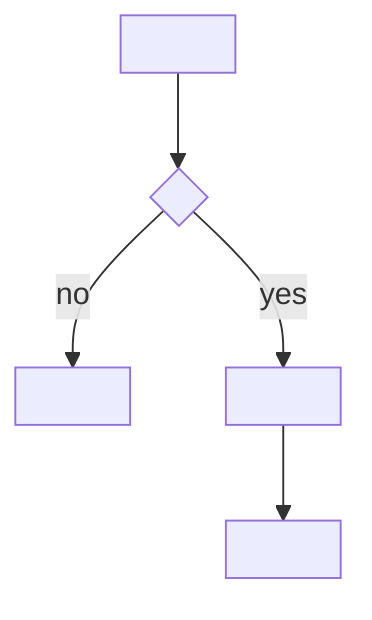

# NN — <title>

**Serves:** <requirement section / decision Q#>

## Description

<what this sub-task delivers, in 2–5 lines>

## Related resource files

- `<path>:<line>` — <why it matters: the pattern to mirror, the code to change>

## Diagrams

<one subsection per diagram in STATUS → Plan format (default: flow). A diagram that doesn't apply: `n/a: <reason>`>

### Flow

## Migration

<none / the migration, its backfill (batched), and what a NULL or legacy row does>

## Exceptions

- <what raises, what is rescued, what the user sees; what must never happen (e.g. "send is never
  called when validation fails")>

## Edge cases

- <empty, duplicate, concurrent, permission-less, legacy data, large input, unicode, timezone, retry, partial failure…>

## Tests

- `<test file>` (run: `<profile test command> <file>`) — <the cases, including the one that proves the guard bites>

## Unclear issues

- <conflicts with the requirement, or steps the requirement doesn't state — for the user at G2>
